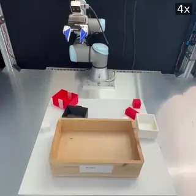
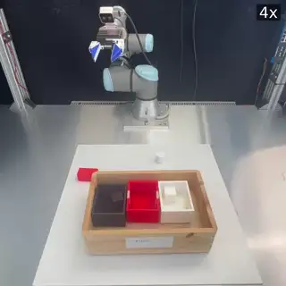
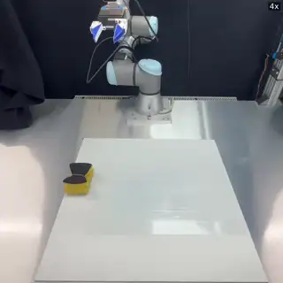

# UR3e Pi0.5 Fine-Tuning

Fine-tuning [π₀.₅](https://www.physicalintelligence.company/blog/pi05) on a **UR3e robot arm** for pick-and-place tasks.  
Forked from [Physical-Intelligence/openpi](https://github.com/Physical-Intelligence/openpi).

## Demo

> All videos are played at **4× speed**. The apparent choppiness is due to time compression of 30fps footage (~7.5 effective fps after 4× acceleration) — not inference latency. The robot executes actions smoothly at 10Hz in real operation.

<table>
  <tr>
    <th align="center">Pick &amp; Place — White Cube</th>
    <th align="center">Pick &amp; Place — White Cylinder</th>
    <th align="center">Pick &amp; Place — White Box</th>
  </tr>
  <tr>
    <td align="center"></td>
    <td align="center"></td>
    <td align="center"></td>
  </tr>
  <tr>
    <th align="center" colspan="3">Wipe Board</th>
  </tr>
  <tr>
    <td align="center" colspan="3"></td>
  </tr>
</table>

---

## Overview

Complete end-to-end pipeline: collect demonstrations via teleoperation on a real UR3e → fine-tune Pi0.5 with LoRA (JAX) → serve the policy → run inference on the robot.

```mermaid
flowchart LR
    A["Uarm Master Arm\n(teleoperation)"] -->|HDF5 episodes\n20Hz| B["Raw Data\ndataset/raw/"]
    B -->|pipeline.sh\ntrim & smooth| C["Processed HDF5"]
    C -->|convert script\ndeg→rad · gripper invert| D["LeRobot Format\ndataset/for_training/"]
    D -->|norm stats + train| E["Pi0.5 Checkpoint\nLoRA · JAX · RTX 6000"]
    E -->|serve.sh| F["Policy Server\ngRPC :8000"]
    F -->|action chunks\n10Hz| G["UR3e Robot\nreal-world execution"]
```



---

## Results

| Metric | Value |
|--------|-------|
| Training steps to convergence | ~20k–33k steps |
| Wall-clock training time | ~35–60h on RTX 6000 48GB / ～2h-6h on H100*2 |
| Final training loss | 0.0006–0.002 |
| Gradient norm at convergence | 0.01–0.05 |
| Inference latency per action chunk | ~300–500ms |
| VRAM usage during training | ~41GB (batch 32, no EMA) |

Three task configs trained across five checkpoint iterations: pick-and-place, assembly, and pick-place-and-arrange.

---

## Key Learnings

The main value of this project is the gap between "the model exists" and "the robot moves correctly." These are the non-obvious things I ran into.

### Data Format Traps

**Gripper convention is inverted between hardware and model.**  
The UR3e HDF5 files record `0 = closed, 1 = open`. Pi0.5 expects `0 = open, 1 = closed`. Applying `gripper_pi05 = 1 - gripper_raw` only in the convert script — and nowhere else — was essential. Inverting twice (once in convert, once in env.py) caused the gripper to behave oppositely at inference time.

**Joint angles are in degrees in HDF5, radians in the model.**  
UR controllers report joint positions in degrees. The convert script applies `deg2rad` once. If it's also applied in `env.py`, the arm moves to completely wrong poses. The rule: one conversion point, zero drift.

**All robot state and action values must be `float32`.**  
JAX silently accepts `float64` inputs but then produces NaN actions after normalization. Enforcing `float32` throughout `env.py` fixed this.

### Training Pitfalls

**EMA adds ~12.5GB VRAM — enough to cause OOM.**  
Exponential moving average of weights is often recommended for stability. On Pi0.5 LoRA with an RTX 6000 (48GB), enabling it pushed VRAM past the limit. Disabling EMA kept training stable at ~41GB with no noticeable quality difference at this scale.

**Norm stats are checkpoint-specific, not dataset-specific.**  
Each checkpoint must load norm stats computed from the exact dataset it was trained on. Reusing stats from an older dataset produces subtly wrong normalizations that are hard to debug from robot behavior alone. I solved this by saving `metadata.json` inside each checkpoint directory at training time, then having `serve.sh` read it automatically — no manual config lookup needed.

**`action_horizon=10` is a hard Pi0.5 model limit.**  
The model's action chunking is fixed at 10 steps. Changing it in config causes shape mismatches at inference. This is also why 10Hz inference works well even for 20Hz-collected data: each chunk covers exactly 1 second of motion.

### Engineering Challenges

**SSH disconnection silently corrupts the dataset mid-conversion.**  
If the terminal drops during HDF5 → LeRobot conversion, the output directory is partially written with no error message. Training then proceeds on corrupted data and produces a model that looks like it converges but behaves randomly on the robot. Fix: always wrap long-running commands in `tmux` or `nohup`. This is now documented prominently in [docs/TRAIN_DEPLOY.md](docs/TRAIN_DEPLOY.md).

**JAX JIT cold start takes ~60s on first inference.**  
The policy server is "ready" before it's actually usable. The first call to the model compiles the computation graph; everything after that is 300–500ms. Any timing benchmark must skip the first call.

**10Hz inference produces smoother motion than 20Hz despite 20Hz training data.**  
At 20Hz, the robot pauses every 50ms waiting for the policy server to return the next action chunk (synchronous inference). At 10Hz, each chunk covers 100ms — the pauses are less frequent and the overall motion arc is smoother. `action_horizon=10` is the natural breakpoint.

### Hardware Integration

**RealSense cameras drop frames occasionally.**  
A single dropped frame with a 0ms timeout crashes the episode. Added retry logic in `env.py`: 3 attempts × 500ms timeout each. The camera recovers reliably within the first retry.

**`servoJ` failure causes joint-position drift.**  
When servoJ throws a communication exception, the software's tracked joint state diverges from the robot's actual position. The next servoJ command then sends the robot to a wrong pose. Fix: re-read actual joint angles from RTDE on every exception before issuing the next command.

---

## Full Pipeline

### 1. Data Collection (Teleoperation)

See [data_collection/README.md](data_collection/README.md) for setup and usage.

```bash
cd teleoperation
bash uarm/scripts/UR5/run_ur5_nodes.sh
```

Episodes are saved as `episode_N.hdf5` under `dataset/raw/`.


### 2. Train (convert → norm stats → train)

One-command pipeline:

```bash
./examples/ur5/train_pipeline.sh \
    --raw-dir dataset/processed/trimmed/<DATE> \
    --repo-id ur5_dataset_<DATE> \
    --exp-name ur5_pick_place_<VERSION>
```

Optional flags: `--skip-convert`, `--skip-stats`, `--resume`, `--fps 20`, `--config pi05_ur5`

Or run steps manually — see [examples/ur5/README.md](examples/ur5/README.md).

### 3. Serve Policy

```bash
./examples/ur5/serve.sh checkpoints/pi05_ur5/<EXP_NAME>/<STEP>
```

`serve.sh` reads `assets/metadata.json` to resolve the correct config automatically.  
First inference takes ~60s (JAX JIT). Subsequent calls: ~300–500ms.

### 4. Run Inference on Robot

```bash
PYTHONPATH=. uv run examples/ur5/main.py \
    --prompt "pick yellow cube and place it into red box"
```

Policy server (Step 3) must be running first.

---

## Installation

```bash
git clone --recurse-submodules https://github.com/YahuanShi/fine-tuning-openpi
GIT_LFS_SKIP_SMUDGE=1 uv sync
GIT_LFS_SKIP_SMUDGE=1 uv pip install -e .
```

---

## Hardware

| Component | Spec |
|-----------|------|
| Robot arm | Universal Robots UR3e |
| Gripper | Weiss Robotics CRG 30-050 (`/dev/ttyACM0`) |
| Exterior camera | Intel RealSense D415 (serial `105422061000`) |
| Wrist camera | Intel RealSense D405 (serial `352122273671`) |
| GPU | NVIDIA RTX 6000 48GB |
| Teleoperation | Uarm master arm → UR3e follower (ROS 2 Humble) |

---

## Task Configs

| Config | Dataset | Task | Latest Checkpoint |
|--------|---------|------|-------------------|
| `pi05_ur5` | `UR5_REPO_ID` env var | pick-and-place (general) | `ur5_pick_place_20260415/19999` |
| `pi05_ur5_assembly` | `ur5_dataset_20260402_assembly` | assembly | `ur5_assembly_v1/19999` |
| `pi05_ur5_pnpa` | `ur5_dataset_20260402_pnpa` | pick-and-place-and-arrange | `ur5_pnpa_v2/19999` |

### Checkpoint History

| Checkpoint | Trained On | Steps | Notes |
|------------|-----------|-------|-------|
| `ur5_pick_place_v3/19999` | `ur5_dataset_20260323` | 19999 | early |
| `ur5_pick_place_v4/19999` | `ur5_dataset_20260331` | 19999 | early |
| `ur5_pick_place_assembly_v1/19999` | `ur5_dataset_20260402` | 19999 | mixed tasks |
| `ur5_pnpa_v2/19999` | `ur5_dataset_20260402` | 19999 | pnpa only |
| `ur5_pick_place_20260415/19999` | `ur5_dataset_20260415` | 19999 | latest pick-and-place |

---

## Environment Variables

| Variable | Purpose | Example |
|----------|---------|---------|
| `UR5_REPO_ID` | Dataset name for `pi05_ur5` config — **required** | `ur5_dataset_20260415` |
| `HF_LEROBOT_HOME` | LeRobot dataset root | `$(pwd)/dataset/for_training` |
| `XLA_PYTHON_CLIENT_MEM_FRACTION` | JAX GPU memory fraction | `0.95` |

`train_pipeline.sh` sets all three automatically.

---

## Key Parameters

| Parameter | Value | Notes |
|-----------|-------|-------|
| Collection Hz | 20 Hz | ~18 Hz also acceptable |
| Training Hz (`--fps`) | 20 Hz | match collection |
| Inference Hz | 10 Hz | least-noticeable pause at `action_horizon=10` |
| `action_horizon` | 10 | Pi0.5 hard limit, do not change |
| `batch_size` | 32 | max stable on RTX 6000 48GB (~41GB VRAM) |
| `ema_decay` | None | EMA adds ~12.5GB VRAM, causes OOM |
| `XLA_PYTHON_CLIENT_MEM_FRACTION` | 0.95 | required for training |
| Gripper convention | 0=open / 1=closed | inverted from raw HDF5 (0=closed / 1=open) |
| Joint angles | radians in model | HDF5 stores degrees; converted in convert script |

---

## Directory Structure

```
fine-tuning-openpi/
├── examples/ur5/           # Robot scripts: convert, env, main, serve.sh, train_pipeline.sh
├── src/openpi/             # Core model library (JAX)
├── scripts/                # train.py, serve_policy.py, compute_norm_stats.py
├── data_processing/        # Data processing pipeline (git submodule)
├── teleoperation/          # ROS 2 teleoperation system (git submodule)
├── packages/openpi-client/ # Lightweight inference client package
├── dataset/
│   ├── raw/                # Original HDF5 recordings (never overwrite)
│   ├── processed/          # Trimmed/smoothed episodes
│   └── for_training/       # LeRobot-converted datasets (HF_LEROBOT_HOME)
├── checkpoints/            # Training checkpoints (gitignored)
├── assets/                 # Norm stats: assets/<config>/<repo_id>/norm_stats.json
└── docs/                   # Additional documentation
```

---

## Documentation

- [examples/ur5/README.md](examples/ur5/README.md) — detailed pipeline reference
- [docs/TRAIN_DEPLOY.md](docs/TRAIN_DEPLOY.md) — deploy training on a new server (Docker)
- [docs/new_server_training_setup.md](docs/new_server_training_setup.md) — step-by-step new server setup (Chinese)
- [docs/data_pipeline_guide.md](docs/data_pipeline_guide.md) — data format and model input deep dive (Chinese)
- [docs/training_inference_guide.md](docs/training_inference_guide.md) — Flow Matching loss and ODE inference deep dive (Chinese)
- [teleoperation/README.md](teleoperation/README.md) — teleoperation setup
- [DEVELOPMENT.md](DEVELOPMENT.md) — conventions and known pitfalls
- [docs/remote_inference.md](docs/remote_inference.md) — remote inference setup
